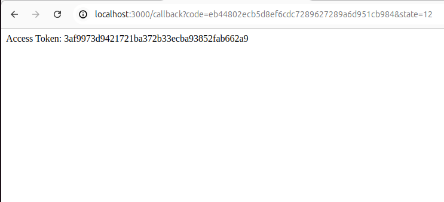
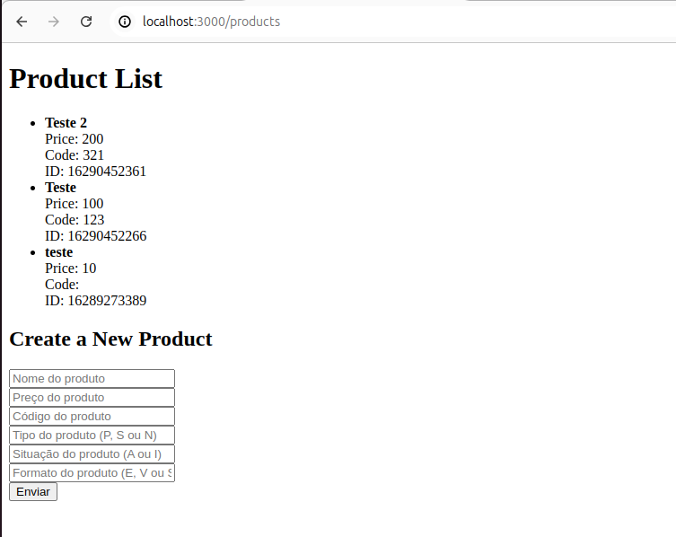

<center> <h1>💻 Bem-vindo 💻</h1> </center>

Como instalar o projeto
Clone o repositório em sua máquina
 ```bash
   git clone "URL DO PROJETO"
   ```

2- Instale as  dependencias do projeto com os seguintes comandos:

   ```bash
   npm install
   ```

3- Rode o projeto

   ```bash
    node server.js
   ```

Um texto indicando a rota do projeto será mostrado no console log, sendo localhost:3000. Após o login de usuário, entre na rota http://localhost:3000/products onde será mostrada a lista de produtos.

<h3>Usuários📌</h3>
Para testar o aplicativo, vá para a rota http://localhost:3000/authorize e faça o login com o usuário:

 ```bash
matheustcampos1904@gmail.com
senha: 33022436Fha@
   ```
No caso de querer testar seu próprio usuário, altere o clientId e clientSecret cadastrados no Bling API.


--------------------

<h3> Imagens funcionamento📌</h3>





## Autor

Feito por Matheus Torsoni👋🏽 Entre em contato!

[](https://twitter.com/tcmatheus_) [](https://www.linkedin.com/in/matheus-torsoni-b33957156/) 
[](matheus_tcampos@hotmail.com)